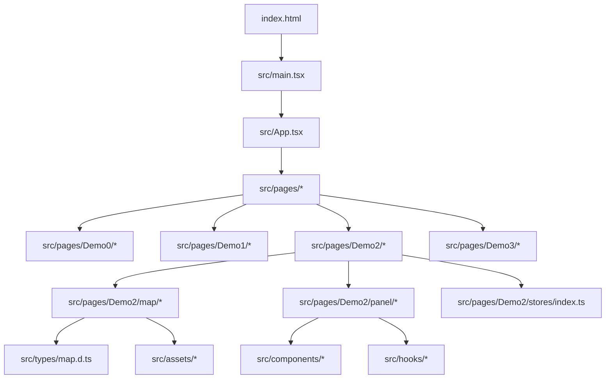

# Code Wiki：sc-datav（数据可视化大屏）

## 1. 项目概览

本仓库是一个前端单页应用（SPA），以 React 19 + TypeScript 为基础，结合 Three.js（通过 React Three Fiber）实现 3D 地图大屏可视化，并使用 ECharts 渲染图表面板。项目同时包含 Demo0~Demo3 四套可视化场景，通过路由切换展示。

- 应用入口： [main.tsx](file:///workspace/src/main.tsx#L1-L13) → [App.tsx](file:///workspace/src/App.tsx#L1-L44)
- 路由页面： [pages](file:///workspace/src/pages)
- 构建工具与发布：Vite + GitHub Pages（`base: "/sc-datav/"`）→ [vite.config.ts](file:///workspace/vite.config.ts#L1-L14)，CI → [publish.yml](file:///workspace/.github/workflows/publish.yml)

## 2. 技术栈与依赖

依赖定义： [package.json](file:///workspace/package.json#L1-L46)

- React / React DOM：应用框架与渲染入口（[main.tsx](file:///workspace/src/main.tsx#L1-L13)）
- react-router：HashRouter + Routes（[main.tsx](file:///workspace/src/main.tsx#L1-L13)，[App.tsx](file:///workspace/src/App.tsx#L31-L40)）
- three + @react-three/fiber + @react-three/drei：Three.js 渲染与常用组件（例如 [Demo2 Map](file:///workspace/src/pages/Demo2/map/index.tsx#L1-L53)）
- @react-three/postprocessing：后处理（仓库已引入，具体使用需在各 Demo 中检索）
- gsap：动画编排（路由淡入 [App.tsx](file:///workspace/src/App.tsx#L11-L29)，地图入场 [Demo2 Base](file:///workspace/src/pages/Demo2/map/base.tsx#L104-L141)）
- echarts：图表渲染（通用封装 [chart.tsx](file:///workspace/src/components/chart.tsx#L1-L70)）
- zustand：轻量状态管理（例如 [Demo2 store](file:///workspace/src/pages/Demo2/stores/index.ts#L1-L16)）
- styled-components：样式与布局（例如 [Demo2 Panel](file:///workspace/src/pages/Demo2/panel/index.tsx#L15-L175)）
- d3-geo / topojson-client：地理投影与数据处理（例如 [Demo2 Base](file:///workspace/src/pages/Demo2/map/base.tsx#L15-L103)）
- leva：调参面板（例如 [Demo3 Model](file:///workspace/src/pages/Demo3/model.tsx#L6-L55)）
- autofit.js：大屏自适应（[autoFit.tsx](file:///workspace/src/components/autoFit.tsx#L1-L29)）

## 3. 目录结构

仓库结构（关键路径）：

```
/
├─ public/                     # 静态公开资源（构建时原样拷贝）
│  ├─ demo_*.jpg               # Demo 预览图（Index 轮播使用）
│  ├─ model/glb/turbine.glb    # Demo3 3D 模型
│  └─ hdr/venice_sunset_1k.hdr # HDR 环境贴图等
├─ src/
│  ├─ main.tsx                 # React 入口（HashRouter）
│  ├─ App.tsx                  # 路由定义 + 页面淡入动画
│  ├─ pages/                   # 页面：Index + Demo0~Demo3
│  ├─ components/              # 通用组件（Chart/AutoFit/动画数字/虚拟滚动等）
│  ├─ hooks/                   # 通用 Hooks（尺寸监听/节流/动画驱动等）
│  ├─ assets/                  # 业务资源（GeoJSON、贴图等，随构建打包）
│  └─ types/                   # 类型声明（GeoJSON/地图数据等）
└─ vite.config.ts              # Vite 配置：base、alias 等
```

## 4. 整体架构

### 4.1 SPA 启动链路

- HTML 挂载点：`#root` → [index.html](file:///workspace/index.html)
- React 启动：`createRoot(...).render(...)` + `HashRouter` → [main.tsx](file:///workspace/src/main.tsx#L1-L13)
- 路由与页面切换：`Routes` + `Route` → [App.tsx](file:///workspace/src/App.tsx#L31-L40)
- 路由切换淡入动画：基于 `location.key` 触发 `gsap.fromTo` → [App.tsx](file:///workspace/src/App.tsx#L11-L29)

### 4.2 页面（Demo）组织方式

以 Demo2 为例，页面入口只负责组合与复位状态：

- 页面入口 `pages/Demo2/index.tsx` 懒加载 `demo.tsx` → [Demo2 index.tsx](file:///workspace/src/pages/Demo2/index.tsx#L1-L7)
- `demo.tsx` 组合 `Map` 与 `Panel`，并在卸载时 `reset store` → [Demo2 demo.tsx](file:///workspace/src/pages/Demo2/demo.tsx#L1-L23)

典型结构（Demo0/Demo1/Demo2 基本一致）：

- `map/`：Three.js 场景（Canvas、灯光、地图、特效）
- `panel/`：大屏 UI 与图表模块
- `stores/`：面板与地图联动开关（入场播放、特效开关等）

### 4.3 模块依赖关系（概览）



## 5. 核心模块职责

### 5.1 src/components（通用组件）

- AutoFit：基于 `autofit.js` 的自适应容器，对外暴露普通的 `div` 能力（除了 `id`） → [autoFit.tsx](file:///workspace/src/components/autoFit.tsx#L1-L29)
- Chart：ECharts 通用封装（生命周期 init/dispose、resize、setOption） → [chart.tsx](file:///workspace/src/components/chart.tsx#L1-L70)
- NumberAnimation：数字滚动动画（IntersectionObserver + GSAP） → [numberAnimation.tsx](file:///workspace/src/components/numberAnimation.tsx#L1-L57)
- SeamVirtualScroll：无缝虚拟滚动表格（ResizeObserver + requestAnimationFrame 驱动） → [seamVirtualScroll.tsx](file:///workspace/src/components/seamVirtualScroll.tsx#L1-L265)
- Button：渐变按钮（纯样式组件） → [button.tsx](file:///workspace/src/components/button.tsx#L1-L73)

### 5.2 src/hooks（通用 Hooks）

- useSize：监听元素尺寸变化（ResizeObserver） → [useSize.ts](file:///workspace/src/hooks/useSize.ts#L1-L22)
- useDebounceEffect：带 debounce 的副作用执行（常用于 resize 等高频场景） → [useDebounceEffect.ts](file:///workspace/src/hooks/useDebounceEffect.ts#L1-L25)
- useMoveTo：面板入场位移动画（GSAP fromTo + pause/restart） → [useMoveTo.ts](file:///workspace/src/hooks/useMoveTo.ts#L1-L56)

### 5.3 src/types（类型）

地图相关 GeoJSON 类型定义与四川省地理数据的约束（MultiPolygon）：

- [map.d.ts](file:///workspace/src/types/map.d.ts#L1-L65)

### 5.4 src/pages（业务页面）

- Index：3D 轮播入口页，用滚轮（ScrollControls）旋转卡片并导航到 Demo 路由 → [Index page](file:///workspace/src/pages/Index/index.tsx#L92-L161)
  - 关键类：`BentPlaneGeometry`（自定义弯曲平面几何体，用于卡片弯折效果） → [Index page](file:///workspace/src/pages/Index/index.tsx#L31-L65)
- Demo0：基础地图轮廓 + 飞线演示（投影 + 飞线/轮廓/底图组合） → [Demo0 map index](file:///workspace/src/pages/Demo0/map/index.tsx#L1-L46)
- Demo1：贴图地图 + 柱状图/云层/热力等特效，store 提供多开关（cloud/bar/heat 等） → [Demo1 store](file:///workspace/src/pages/Demo1/stores/index.ts#L1-L26)，[Demo1 Base](file:///workspace/src/pages/Demo1/map/base.tsx#L22-L142)
- Demo2：完整大屏（地图入场 + 面板联动 + 多图表模块），属于仓库的“主展示”形态
  - Map：Canvas + Lights/Base/Bottom/Mirror/BeamLight 等组合 → [Demo2 Map](file:///workspace/src/pages/Demo2/map/index.tsx#L1-L53)
  - Panel：AutoFit + Header + 多卡片图表，订阅 `mapPlayComplete` 决定何时入场 → [Demo2 Panel](file:///workspace/src/pages/Demo2/panel/index.tsx#L101-L175)
  - Store：`mapPlayComplete` 控制地图完成后触发 UI 入场 → [Demo2 store](file:///workspace/src/pages/Demo2/stores/index.ts#L1-L16)
- Demo3：3D 模型展示 + Leva 控制“拆解/还原”，并用 GSAP 对 Mesh 位置做动画 → [Demo3 Model](file:///workspace/src/pages/Demo3/model.tsx#L8-L78)

## 6. 关键实现与数据流

### 6.1 地图渲染通用流程（以 Demo2 Base 为例）

入口组件： [Demo2 Base](file:///workspace/src/pages/Demo2/map/base.tsx#L36-L173)

- 输入数据：四川 GeoJSON（`sc.json`、`sc_outline.json`）在 Map 层加载 → [Demo2 Map](file:///workspace/src/pages/Demo2/map/index.tsx#L10-L16)
- 投影：用 `d3-geo` 的 `geoMercator()` 将经纬度映射到平面坐标 → [Demo2 Base](file:///workspace/src/pages/Demo2/map/base.tsx#L41-L46)
- 区域切片：遍历 `features` 生成每个市州的多边形点集、中心点 → [Demo2 Base](file:///workspace/src/pages/Demo2/map/base.tsx#L47-L81)
- 生成几何：将点集转为 `Shape/ShapeGeometry`，再做挤出/材质 → [Demo2 Base City](file:///workspace/src/pages/Demo2/map/base.tsx#L191-L246)
- 入场动画：用 GSAP timeline 推动相机/地图 group 的 position/scale/material opacity → [Demo2 Base](file:///workspace/src/pages/Demo2/map/base.tsx#L104-L141)
  - 动画完成后设置 `mapPlayComplete = true` → [Demo2 Base](file:///workspace/src/pages/Demo2/map/base.tsx#L115-L118)

### 6.2 地图 → 面板联动（以 Demo2 为例）

- 地图入场动画结束：`useConfigStore.setState({ mapPlayComplete: true })` → [Demo2 Base](file:///workspace/src/pages/Demo2/map/base.tsx#L115-L118)
- 面板订阅状态并触发入场：`useConfigStore.subscribe(..., v => v && restart())` → [Demo2 Panel](file:///workspace/src/pages/Demo2/panel/index.tsx#L110-L129)
- 入场动画实现：`useMoveTo()` 返回 `{ ref, restart }`，内部用 `gsap.fromTo(...).pause()` → [useMoveTo](file:///workspace/src/hooks/useMoveTo.ts#L6-L56)

这套联动方式的特点是：

- Map 与 Panel 通过 store 解耦
- Panel 不需要等待异步资源，只需要等待“地图动画完成”的信号

### 6.3 ECharts 组件封装与使用

通用封装： [Chart](file:///workspace/src/components/chart.tsx#L1-L70)

- `echarts.init(container)`：创建实例 → [chart.tsx](file:///workspace/src/components/chart.tsx#L41-L49)
- `useDebounceEffect + resizeObserver`：自适应容器变化 → [chart.tsx](file:///workspace/src/components/chart.tsx#L51-L57)
- `setOption(memoOption)`：更新 option，`replaceMerge: ["series"]` 避免 series 残留 → [chart.tsx](file:///workspace/src/components/chart.tsx#L59-L67)

典型使用（Demo2 Panel Chart1）：

- 通过 `use` 参数按需注册图表/组件，避免全量引入 → [Demo2 panel chart1](file:///workspace/src/pages/Demo2/panel/chart1.tsx#L118-L125)
- 同一个面板模块里可组合多个 `Chart`（柱图 + 饼图） → [Demo2 panel chart1](file:///workspace/src/pages/Demo2/panel/chart1.tsx#L118-L273)

### 6.4 自定义 Shader（以 Demo2 ShiftMaterial 为例）

`ShiftMaterial` 由 `@react-three/drei` 的 `shaderMaterial()` 构建，并通过 `extend()` 注册为 JSX 元素（本文件 default export 的 side-effect）：

- [shaderMaterial.tsx](file:///workspace/src/pages/Demo2/map/shaderMaterial.tsx#L1-L53)

功能要点：

- uniform `time` 在 `City` 的 `useFrame` 中持续累加，用于扫描带动画 → [Demo2 Base City](file:///workspace/src/pages/Demo2/map/base.tsx#L197-L201)

### 6.5 跟随轨迹效果（GeoTrail）

- 根据 outline feature 计算点序列，并用 `useFrame` 让 follower 在点集上循环移动 → [geoTrail.tsx](file:///workspace/src/pages/Demo2/map/geoTrail.tsx#L19-L41)
- 用 `Trail` 根据 follower 轨迹渲染拖尾 → [geoTrail.tsx](file:///workspace/src/pages/Demo2/map/geoTrail.tsx#L43-L53)

## 7. 运行与构建

### 7.1 环境要求

README 指定：

- Node.js >= 18
- PNPM >= 8

见 [README.md](file:///workspace/README.md#L86-L114)

### 7.2 本地运行

```bash
pnpm install
pnpm dev
```

脚本定义见 [package.json](file:///workspace/package.json#L6-L11)

### 7.3 构建与预览

```bash
pnpm build
pnpm preview
```

构建链路：`tsc -b`（TypeScript project references）+ `vite build` → [package.json](file:///workspace/package.json#L6-L11)

### 7.4 静态部署（GitHub Pages）

- Vite `base: "/sc-datav/"`：用于部署在 `https://<user>.github.io/sc-datav/` 子路径下 → [vite.config.ts](file:///workspace/vite.config.ts#L6-L13)
- 路由采用 HashRouter：无需服务端 rewrite（适合静态托管）→ [main.tsx](file:///workspace/src/main.tsx#L1-L13)
- CI：tag 触发构建与发布到 gh-pages → [publish.yml](file:///workspace/.github/workflows/publish.yml)

## 8. 扩展与二次开发指引

### 8.1 新增一个 Demo 页面

建议复用现有结构：

- `src/pages/DemoX/`
  - `index.tsx`：懒加载 `demo.tsx`（参考 [Demo2 index.tsx](file:///workspace/src/pages/Demo2/index.tsx#L1-L7)）
  - `demo.tsx`：组合 `Map/Panel`，并在卸载时 reset store（参考 [Demo2 demo.tsx](file:///workspace/src/pages/Demo2/demo.tsx#L13-L22)）
  - `stores/index.ts`：定义联动信号（例如 `mapPlayComplete`）
  - `map/` 与 `panel/`：分别承载 Three 场景与 UI 图表
- 在路由中注册：
  - [App.tsx](file:///workspace/src/App.tsx#L31-L40)

### 8.2 新增图表模块

- 在 `panel/` 下新增 `chartX.tsx`
- 直接使用通用 [Chart](file:///workspace/src/components/chart.tsx#L1-L70) 组件
- 将 ECharts 的图表类型与组件通过 `use={[...]}` 按需注册（参考 [Demo2 panel chart1](file:///workspace/src/pages/Demo2/panel/chart1.tsx#L118-L125)）

## 9. 快速索引（关键入口）

- 启动入口： [main.tsx](file:///workspace/src/main.tsx#L1-L13)
- 路由： [App.tsx](file:///workspace/src/App.tsx#L31-L40)
- Index 轮播： [pages/Index/index.tsx](file:///workspace/src/pages/Index/index.tsx#L92-L218)
- Demo2 主展示：
  - 入口组合： [Demo2 demo.tsx](file:///workspace/src/pages/Demo2/demo.tsx#L1-L23)
  - 地图 Map： [Demo2 map/index.tsx](file:///workspace/src/pages/Demo2/map/index.tsx#L1-L53)
  - 地图 Base： [Demo2 map/base.tsx](file:///workspace/src/pages/Demo2/map/base.tsx#L36-L256)
  - 面板 Panel： [Demo2 panel/index.tsx](file:///workspace/src/pages/Demo2/panel/index.tsx#L101-L175)
  - store： [Demo2 stores/index.ts](file:///workspace/src/pages/Demo2/stores/index.ts#L1-L16)

